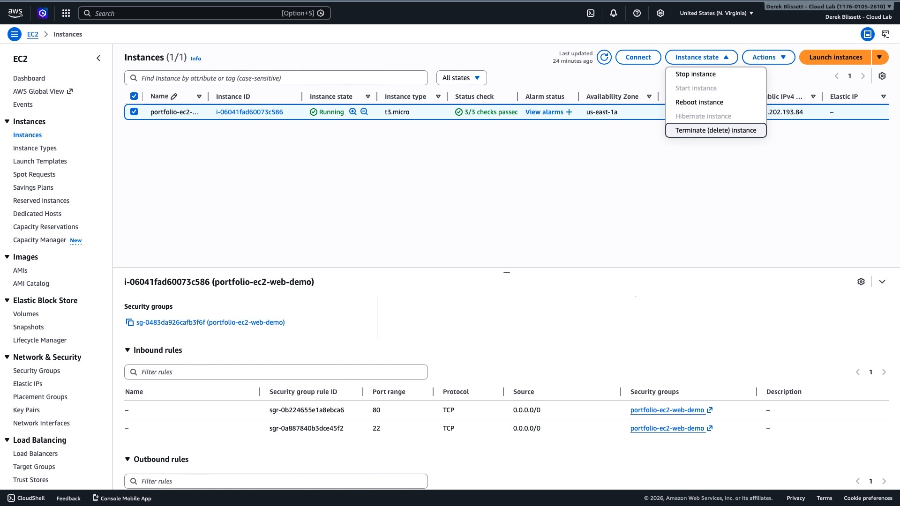
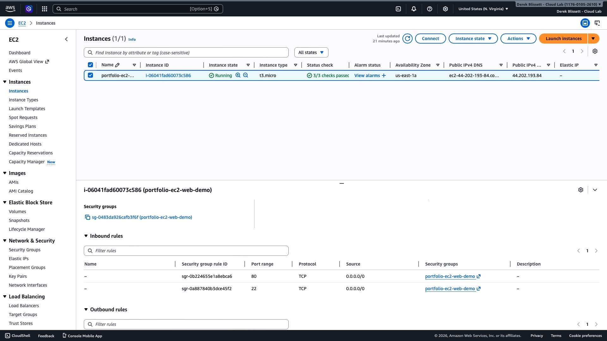

# AWS EC2 Portfolio Demo — Public Web Server

## Overview
This project demonstrates a secure, recruiter-friendly AWS EC2 
deployment: provisioning a Linux instance, configuring network access 
safely, installing and running Nginx, and cleanly tearing down resources.

**What this proves:**
* **Cloud Operations:** End-to-end deployment and lifecycle management.
* **Security First:** Least-privilege access (SSH restricted to My IP).
* **Documentation:** Clear, repeatable runbooks for team environments.

---

## 🏗️ Architecture
**Internet User** → **Security Group** (Port 80 Open) → **EC2 
Instance** (Amazon Linux 2023) → **Nginx**

Detailed flow available in [architecture.md](./architecture.md).

---

## 📸 Proof of Deployment
Below are the artifacts verifying the successful deployment:

### 1. Public Webpage

### 2. Security Group Rules

### 3. Instance Details

---

## 🚀 How to Reproduce
Follow the step-by-step instructions in the [Runbook](./runbook.md).

## 💰 Cost Control & Teardown
To avoid unnecessary AWS charges, this instance was terminated 
immediately after verification. See the teardown checklist in the runbook 
for details.]

