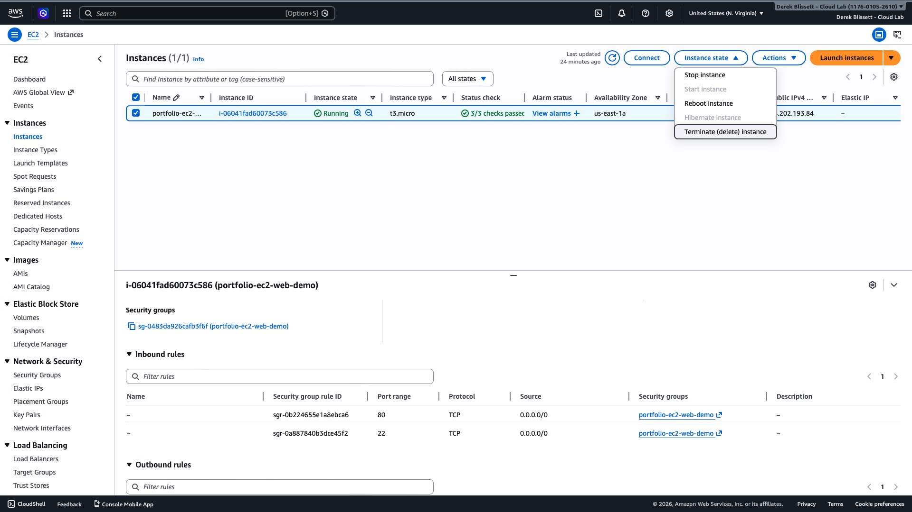
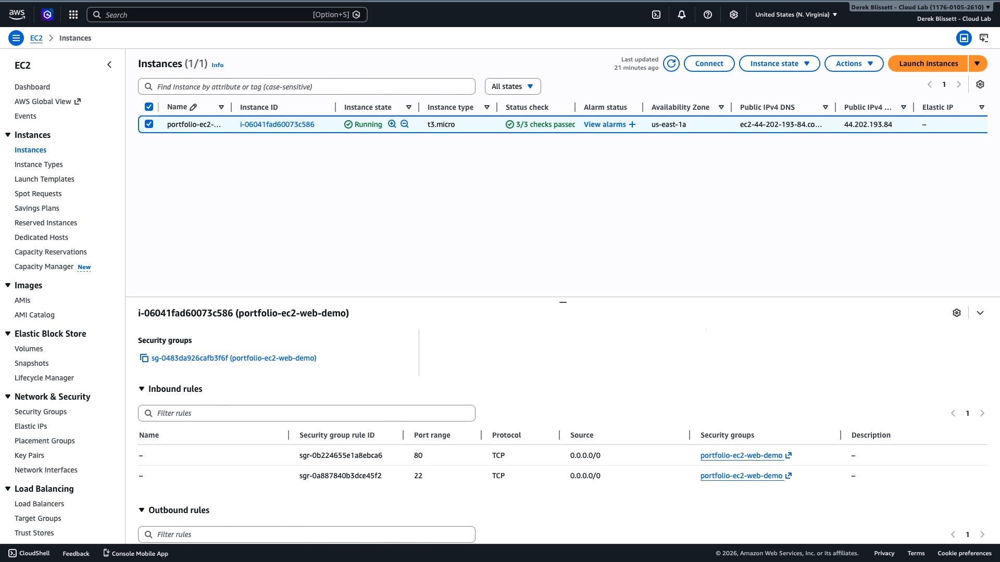

# AWS EC2 Portfolio Deployment — Secure Public Web Server

## Overview

This project demonstrates an end-to-end AWS EC2 deployment built around three things I care about in operations: **secure execution, clear documentation, and disciplined resource management**.

I provisioned an Amazon Linux 2023 EC2 instance, configured network access, installed and ran Nginx, verified the deployment, documented the process, and then terminated the resource to avoid unnecessary cost.

This was not just an exercise in launching a server. The goal was to understand the operating decisions around the technology: how access is controlled, how the environment is documented, how the deployment can be repeated, and how resources are managed after the work is complete.

## What This Demonstrates

**Cloud Operations**  
Provisioning, configuring, validating, and retiring an AWS EC2 resource through its full lifecycle.

**Security Awareness**  
Using security-group rules and restricting SSH access to a known IP rather than leaving administrative access broadly open.

**Operational Documentation**  
Creating a repeatable runbook and architecture reference so the process can be understood and reproduced.

**Cost Control**  
Treating teardown as part of the deployment process instead of leaving unused infrastructure running.

---

## Architecture

**Internet User → Security Group (Port 80) → EC2 Instance (Amazon Linux 2023) → Nginx**

See the detailed flow in [architecture.md](./architecture.md).

---

## Proof of Deployment

### Public Webpage

### Security Group Rules

### Instance Details

---

## How to Reproduce

The full deployment process is documented in the [runbook](./runbook.md).

The runbook covers the steps used to provision the instance, configure access, install Nginx, verify the deployment, and clean up the environment afterward.

---

## Tools & Technologies

- Amazon EC2
- Amazon Linux 2023
- Nginx
- AWS Security Groups
- SSH
- GitHub
- Technical documentation and runbooks

---

## Skills Demonstrated

- Cloud resource lifecycle management
- Linux server administration
- Network access configuration
- Security-first thinking
- Deployment verification
- Technical documentation
- Repeatable process design
- Cost-conscious resource management

---

## Why This Project Matters

I am building deeper technical capability because I want to understand the technology inside the operation, not just manage around it.

Cloud platforms are powerful, but the technology still depends on good decisions around access, documentation, process, ownership, and resource management.

This project is one example of how I am connecting hands-on technical learning with the same operational discipline I bring to process improvement and service delivery.

---

## Cost Control & Teardown

The EC2 instance was terminated immediately after the deployment was verified to avoid unnecessary AWS charges.

The teardown checklist is included in the runbook.
